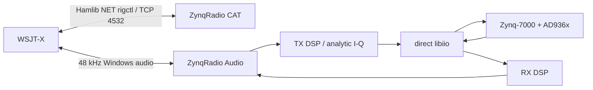

# Architecture

## CAT path

ZynqRadio exposes a Hamlib NET rigctl-compatible server on `127.0.0.1:4532`. WSJT-X can therefore tune the AD936x LO and control PTT without a separate rig-control process.

## RX path

The proven full-duplex configuration intentionally places the hardware RX LO 10 kHz below the CAT dial frequency. In low-bandwidth mode only the physical I channel is transported from the IIO RX stream. The wanted real-signal component at +10 kHz is translated to baseband in DSP while the image moves away from the narrow channel and is rejected. This reduces host RX transport bandwidth by roughly 50% compared with full I/Q transport.

## TX path

WSJT-X audio is captured at 48 kHz, converted to analytic I/Q, interpolated to the configured IIO rate, and streamed directly to the AD936x TX DMA path. The v1.0 design uses a prebuffer and tail-drain state machine so a complete FT8 frame is not damaged by host audio FIFO starvation.
